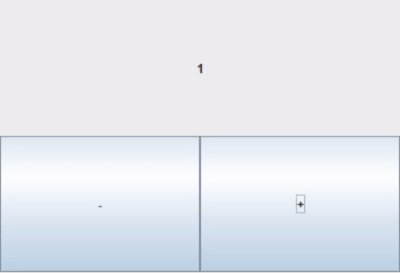

# frogui
#### the kotlin library providing DSL for Swing
## add dependency
### Gradle Kotlin DSL
#### build.gradle.kts
```kotlin
repositories {
    mavenCentral()
}

dependencies {
    implementation("io.github.muqhc:frogui:0.1.0")
}
```

## examples
### to use....
```kotlin
import io.github.muqhc.frogui.*
```
### JPanel to JFrame
```kotlin
JPanel().asFrame //or JPanel().toJFrame()
```

---

### build JPanel  (by using frogui dsl)
```kotlin
val helloPanel = JPanel() borderLayout {
    //add component to 'north'
    north = JButton("I'm north!")
    
    //add component to 'south'
    south = JButton("I'm south!")

    //add component to 'center'
    center = gridLayout { // add inner panel
        layout.columns = 2

        //use 'unary plus' to add component
        +JButton("I'm the First!")

        +flowLayout { // add inner panel
            +JButton("[ 1 ]")
            +JButton("[ 2 ]")
            +JButton("[ 3 ]")
        }
    }
}
```


---

### make your own custom JPanel
```kotlin
class CounterPanel() : JPanel() {
    var value = 0

    val device = JLabel("$value").apply { horizontalAlignment = JLabel.CENTER }

    init {
        // ==== Here !!! ====
        gridLayout {
            layout.rows = 2
            +device
            +gridLayout {
                layout.columns = 2
                +JButton("-").apply { addActionListener { update(value - 1) } }
                +JButton("+").apply { addActionListener { update(value + 1) } }
            }
        }
        // ==========
    }

    fun update(value: Int) {
        this.value = value
        device.text = value.toString()
    }
}
```


---

### [other example code](frogui-debug/src/main/kotlin/io/github/muqhc/frogui)
